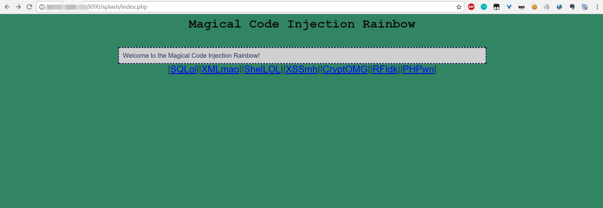

MCIR 是一个漏洞测试平台框架
包含SQL注入、XXE、命令执行、PHP代码注入、XSS、RFI等7个模块
既可以用来做漏洞练习，也可以用来做代码审计练习
支持docker环境部署

## 0x01
```
git clone https://github.com/SpiderLabs/MCIR.git
```

## 0x02
```
cd MCIR
docker-compose up -d
```


